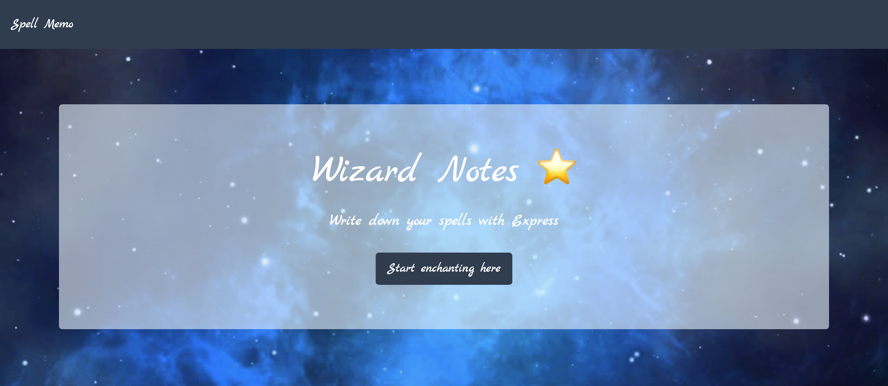
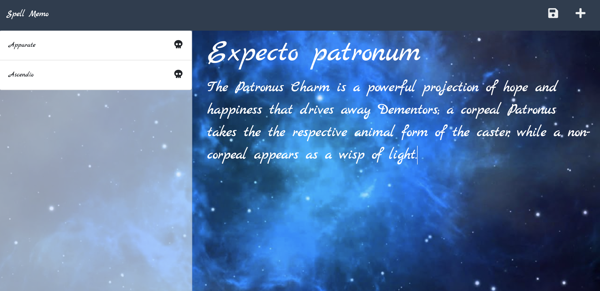

# Note taker for spells!


## Description
Write down all your spells in one conveniently located digital space, best wizardry magic in the cosmos, the internet. Create spells and remove notes at ease with just a click of a button.

The application is deployed on Heroku. Please visit this [link](https://infinite-fjord-02475.herokuapp.com/) to view your magic note taker.




## Table of Contents

* [Installation](#installation)
* [Usage](#usage)
* [Licenses](#licenses)
* [Contributing](#contributing)
* [Questions](#questions)

## Installation 
Please run the following command line to install the neccesary packages
```
npm i
```

## Usage
How to use this code

Head over to https://infinite-fjord-02475.herokuapp.com/ and get started on your first spell!

If you would like to run it in your local host, run the following command

```
npm start
```


## Licenses
This project is under the MIT License.

## Contributing
Contributions are what make the open source community such an amazing place to learn, inspire, and create. 

Feel free to input any new ideas if you'd like with the spells theme.


## Questions

If you have any questions regarding this repository, you can contact me directly at jh.yield@gmail.com or find more of my work at [Key16](https://github.com/Key16)